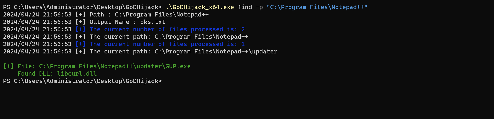
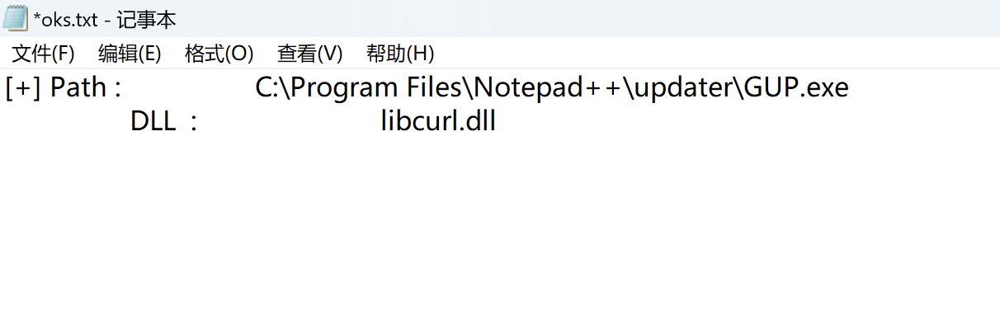
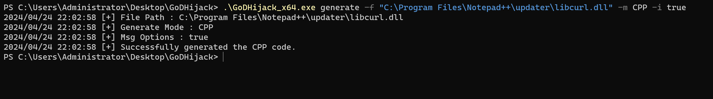
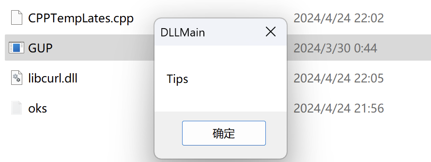

# GoDHijack 
> Red team tool designed for quickly identifying hijackable programs, evading antivirus software, and EDR (Endpoint Detection and Response) systems.

> Current version  v1.0
- Supports searching for x86 / x64 programs.
- May circumvent DLLMain deadlock (as it can directly use exported functions).
- Accuracy 96%
- Supports traversing all directories
- Instead of simply looking for dlls loaded by LoadLibraryA (this kind of DLL can use DllMain directly)

> To be done in the next version
- [ ] Adding a Manually Specified PE Schema (32 |64)
- [ ] Processing that exported functions cannot be called directly
- [ ] Automatically generate DLL template after identification
- [ ] Subsequent open source
 
## Uses
```shell
GoDHijack> .\GoDHijack_x86.exe
Error: missing required argument
Usage:
  GoDHijack [flags]
  GoDHijack [command]

Available Commands:
  completion  Generate the autocompletion script for the specified shell
  find        Automated search for vulnerable programs susceptible to hijacking.
  generate    Automatically generate hijacking templates
  help        Help about any command

Flags:
  -h, --help   help for GoDHijack

Use "GoDHijack [command] --help" for more information about a command.
```

###  Use find

> oks.txt


## Use generate


## Check
